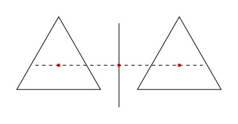

I need a solid declarative diagramming library or tool that I can invest time
in. I always wanted to learn Haskell's `diagrams` library. In this post, I will
give it a try.

<!--more-->

## Motivation

I like drawing. Most people I know are _visual_ people. I decided to find a
decent diagramming tool which I can integrate in both my workflow and programs.

I can go two ways:

1. Use a low-level language like [TikZ] and hate my life (I did before), or
2. Use a high-level language like [Plant UML], [D2], [Graphviz] which are good
   for the purpose they are designed for, but not for generic purpose
   diagramming.

I think that I need something in between. Recently, I was checking [typst]. It
is quite impressive. But I am not sure if I need a better LaTeX.

I have been seeing the [diagrams] Haskell library for a while. I know, it is
quite low-level to use for occassional reasons, but high-level and generic
enough to use in a program. It is time to give it a try.

## Getting Our Hands Dirty

This blogpost is written in Literate Haskell. All the images produced in this
post are generated by this post itself evertime I (or GitHub Action) build this
blog. You can check the source code of my blog.

Let's start...

I am simply going to add `diagrams` to my Haskell dependencies along with the
`markdown-unlit` program.

```nix
{
  ##...

  ghc = pkgs.haskellPackages.ghcWithPackages (hpkgs: [
    ## ...
    hpkgs.diagrams
    hpkgs.markdown-unlit
    ## ...
  ]);

  thisShell = pkgs.mkShell {
    buildInputs = [
      ## ...

      ghc

      ## ...
    ];

    NIX_GHC = "${ghc}/bin/ghc";
    NIX_GHCPKG = "${ghc}/bin/ghc-pkg";
    NIX_GHC_DOCDIR = "${ghc}/share/doc/ghc/html";
    NIX_GHC_LIBDIR = "${ghc}/lib/ghc-9.6.5/lib";
  };

  # ...
}
```

`diagrams` tutorial says that we may need to enable some language extensions.
But we will not need them in this port. We just need some imports:

```haskell
import Diagrams.Backend.SVG
import Diagrams.Prelude
import System.Environment (getArgs)
```

We will generate 11 SVG diagrams in this tutorial. Let's implement our entry
point:

```haskell
main :: IO ()
main = do
  dir <- head <$> getArgs
  render dir "diagram1.svg" diagram1
  render dir "diagram2.svg" diagram2
  render dir "diagram3.svg" diagram3
  render dir "diagram4.svg" diagram4
  render dir "diagram5.svg" diagram5
  render dir "diagram6.svg" diagram6
  render dir "diagram7.svg" diagram7
  render dir "diagram8.svg" diagram8
  render dir "diagram9.svg" diagram9
  render dir "diagram10.svg" diagram10
  render dir "diagram11.svg" diagram11
  where
    render dpath fname = renderSVG (dpath <> "/" <> fname) (mkSizeSpec2D (Just 400) Nothing) . frame 0.2
```

This is how we will invoke it:

```sh
runhaskell -pgmLmarkdown-unlit index.lhs .
```

Let's start with a triangle:

```haskell
diagram1 :: Diagram B
diagram1 =
  triangle 1
```


We can use the `|||` function to place two triangles side by side:

```haskell
diagram2 :: Diagram B
diagram2 =
  triangle 1 ||| triangle 1
```


How about putting a list of shapes side by side separated by a gap?

```haskell
diagram3 :: Diagram B
diagram3 =
  hsep 0.2 $
    [ triangle 1
    , triangle 1
    ]
```


`diagrams` has a concept of `origin`. We can show the origin of a diagram by
using the `showOrigin` function:

```haskell
diagram4 :: Diagram B
diagram4 =
  showOrigin $ triangle 1
```


It works for the shapes composed together as well:

```haskell
diagram5 :: Diagram B
diagram5 =
  showOrigin . hsep 0.2 $
    [ triangle 1
    , triangle 1
    ]
```


But that is a little strange, right? Why is the origin not in the center of the
composed shape, but of the first shape?

This is how `hsep` works. It does not shift the origin to the center of the
composed shape. We can use the `centerX` function to shift the origin to the
center of the resulting diagram along the x-axis:

```haskell
diagram6 :: Diagram B
diagram6 =
  showOrigin . centerX . hsep 0.2 $
    [ triangle 1
    , triangle 1
    ]
```


How about adding a vertical line between the triangles?

```haskell
diagram7 :: Diagram B
diagram7 =
  centerX . hsep 0.2 $
    [ triangle 1
    , vrule 1
    , triangle 1
    ]
```


OK, but why is the vertical line not centered? Let's check the origins for these
3 shapes:

```haskell
diagram8 :: Diagram B
diagram8 =
  (ruler 2) `atop` diagram
  where
    ruler  = dashingN [0.02, 0.02] 0 . hrule
    diagram = centerX . hsep 0.2 $
        [ showOrigin $ triangle 1
        , showOrigin $ vrule 1
        , showOrigin $ triangle 1
        ]
```



Of course! The origin along the y-axis is anchored to the first shape's origin
that is a triangle. And the center of this equilateral triangle is not the
center of its height. See your nearest analytical geometry book for details!

Let's align the shapes at to the top of the shapes:

```haskell
diagram9 :: Diagram B
diagram9 =
  centerX . (composeAligned alignT (hsep 0.2)) $
    [ triangle 1
    , vrule 1
    , triangle 1
    ]
```


Good! let's connect the top points of the triangles with a horizontal line of
length `0.5 + 0.2 + 0.2 + 0.5`:

```haskell
diagram10 :: Diagram B
diagram10 =
  hrule 1.4 === diagram9
```


OK, now the final diagram attempt which will render some text inside the
triangles:

```haskell
diagram11 :: Diagram B
diagram11 =
  hrule 1.4 === hcom
  where
    work = triangle 1 === scale 0.15 (alignedText 0.5 0 "work")
    life = triangle 1 === scale 0.15 (alignedText 0.5 0 "life")
    hcom = centerX . (composeAligned alignT (hsep 0.2)) $ [work, vrule 1, life]
```


## Wrap-Up

In this tutorial, we glimpsed through the basics of the `diagrams` library.

Now that we have established work-life balance, I can get ready for the next
chapter of my life with `diagrams`.

<!-- REFERENCES -->

[TikZ]: https://en.wikipedia.org/wiki/PGF/TikZ
[Plant UML]: https://plantuml.com
[D2]: https://d2lang.org
[Graphviz]: https://graphviz.org
[typst]: https://typst.app
[diagrams]: https://diagrams.github.io
