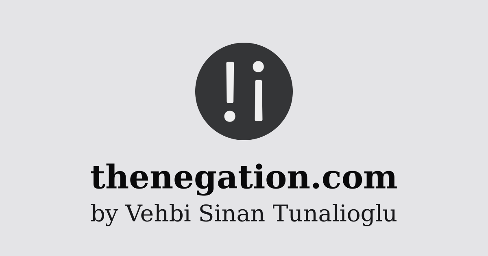

In this blog post, we are continuing to play with Haskell's [diagrams] library.
We will write a literate Haskell program to generate an [OpenGraph] image.

<!--more-->

## Motivation

I am told that my Website pages should have [OpenGraph] images. So, I stopped
worrying about not worrying about content, and I started worrying about not
having an [OpenGraph] image.

So, let's do one.

## Program

We will use the 3 Haskell packages for this Literate Haskell program like
before: [diagrams], [diagrams-cairo] and [markdown-unlit].

Let's import a few modules.

```haskell
import Diagrams.Backend.Cairo
import Diagrams.Prelude
import System.Environment (getArgs)
```

Now, our entry point what will render an [OpenGraph] image with size `1200x630`
and extension `.png`:

```haskell
main :: IO ()
main = do
  dir <- head <$> getArgs
  logo <- loadLogo
  render dir "og.png" (og "thenegation.com" "by Vehbi Sinan Tunalioglu" logo)
  where
    render dpath fname = renderCairo (dpath <> "/" <> fname) (mkSizeSpec2D (Just 1200) (Just 630))
```

This is how we will run our blog post:

```sh
runhaskell -pgmLmarkdown-unlit index.lhs .
```

Let's load my Website's logo image inside a `Diagram B` value. We are scaling
the diagram to `24`:

```haskell
loadLogo :: IO (Diagram B)
loadLogo = do
  (Right img) <- loadImageEmb "../../../static/android-chrome-512x512.png"
  pure $ scaleUToX 24 $ image img
```

Let's create a function to clip a given image in a circle. We will use the
`clipBy` function to achieve this. Since our square image is scaled to `24`, We
are using a circle with a radius of `12`:

```haskell
mkAvatar :: Diagram B -> Diagram B
mkAvatar =
  clipBy (circle 12)
```

Let's put some large text and then some smaller text under the avatar image to
compose our OpenGraph image. Note that we use a canvas of `120x63`, which is
proportional to the OpenGraph image size of `1200x630` and play with arbitrary
colours:

```haskell
og :: String -> String -> Diagram B -> Diagram B
og txtB txtS img =
  logotype `atop` (rect 120 63 # fc (sRGB24read "#e4e4e7")  # lw none)
  where
    logotype =
      center $ vsep 9
        [ mkAvatar img
        , text txtB # bold # fontSizeL 6 # fc (sRGB24read "#09090b")
        , text txtS # fontSizeL 4.27 # fc (sRGB24read "#18181b")
        ]
```

That's all! Let's see how SVG, PNG and JPG images look like:



## Wrap-Up

We have created an [OpenGraph] image for my Website. The next challange will be
to add my blog post title and description to the image dynamically. I am not
sure how to do that yet, especially with flowing text.

<!-- REFERENCES -->

[diagrams]: https://diagrams.github.io
[cairo]: https://cairographics.org
[diagrams-cairo]: https://hackage.haskell.org/package/diagrams-cairo
[markdown-unlit]: https://hackage.haskell.org/package/markdown-unlit
[OpenGraph]: https://ogp.me
