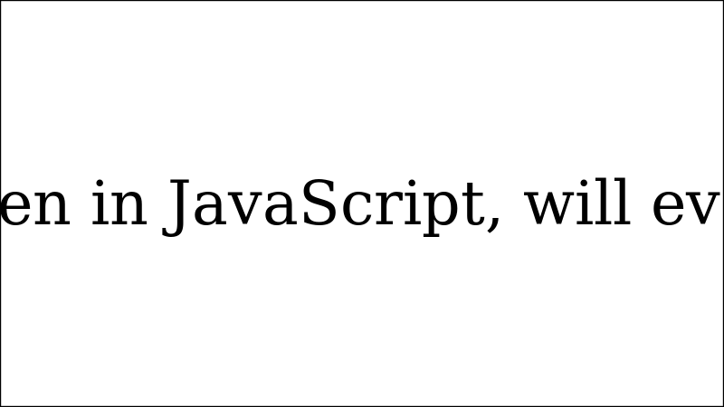
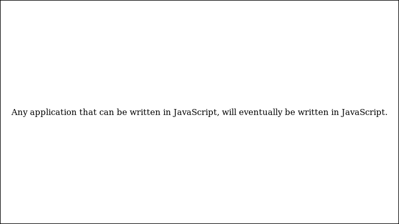
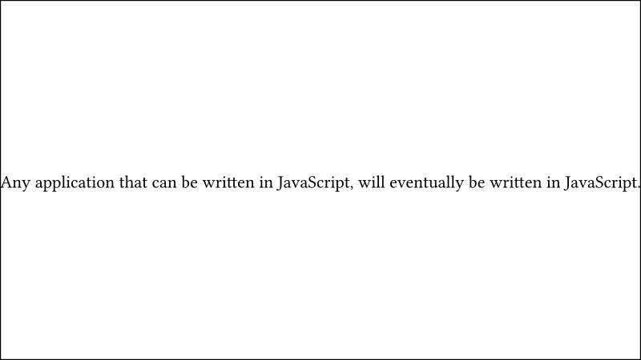
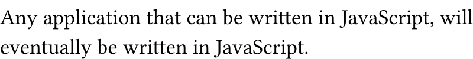

Working with text, especially wrapping it, can be tricky when generating images
with Haskell's [diagrams] library. In this blog post, we will write a literate
Haskell program to generate an image with text that fits in a box and wraps if
we want so.

<!-- more -->

## Problem

Since I am getting more invested in [diagrams], I want to be equipped with
additional superpowers to deal with text.

Working with text in [diagrams] is not as straightforward as I thought. Indeed,
the primary function to work with text is `text` and its documentation [says]:

> Note that it takes up no space, as text size information is not available.

Bummer! This means we cannot calculate the size of the text to wrap it in a
limited area.

## Solution

It seems that there is a nice library to work with text: [SVGFonts]. It
advertised itself as _"Native font support for the diagrams framework"_. Also do
not let the name fool you:

> Note that this package can be used with any diagrams backend, not just the SVG
> backend. The SVG-font format is easy to parse and was therefore chosen for a
> font library completely written in Haskell.

## Program

We will use the 4 Haskell packages for this Literate Haskell program:
[diagrams], [diagrams-cairo], [SVGFonts] and [markdown-unlit].

Let's import our modules of interest:

```haskell
import Diagrams.Backend.Cairo
import Diagrams.Prelude
import qualified Graphics.SVGFonts as F
import qualified Graphics.SVGFonts.Wrap as F.Wrap
import Data.Maybe (fromMaybe)
import System.Environment (getArgs)
```

We will render a few diagrams with our program. Let's implement our entry point
what will render these diagrams:

```haskell
main :: IO ()
main = do
  dir <- head <$> getArgs
  render dir "diagram1.png" diagram1
  render dir "diagram2.png" diagram2
  render dir "diagram3.png" diagram3
  render dir "diagram4.png" diagram4
  where
    render dpath fname = renderCairo (dpath <> "/" <> fname) (mkSizeSpec2D (Just 800) Nothing)
```

This is how we will run our blog post:

```sh
runhaskell -pgmLmarkdown-unlit index.lhs .
```

We need an inspiring text to work with:

```haskell
nice :: String
nice = "Any application that can be written in JavaScript, will eventually be written in JavaScript."
```

OK, let's put it out there, on a rectable of size `16x9`:

```haskell
diagram1 :: Diagram B
diagram1 =
  (text nice) `atop` (rect 16 9 # bg white)
```



Let's fit it in a box of size `16x9`:

```haskell
diagram2 :: Diagram B
diagram2 =
  (text nice # fontSizeL 0.25) `atop` (rect 16 9 # bg white)
```



We can not afford playing with the font size everytime. How about giving a shot
to the `fit_width` function from [SVGFonts]?

```haskell
diagram3 :: Diagram B
diagram3 =
  (nice # F.svgText def # F.fit_width 16 # F.set_envelope # fc black # lw none # center) `atop` (rect 16 9 # bg white)
```



Yes, there is a lot more ceremony. But knowing the canvas' width is enough for
us.

Ok, let's wrap it. This is going to be tricky, if not too difficult:

```haskell
diagram4 :: Diagram B
diagram4 =
  bgFrame 0 white $ vsep 0.2 (fmap putTxt (fromMaybe ["what happened?"] mLines))
  where
    mLines = F.Wrap.wrapText def 1 [(F.Wrap.splitAtSpaces, (14 :: Double, 16))] nice
    putTxt = lw none . fc black . F.set_envelope . F.svgText def
```



## Wrap-Up

[SVGFonts] is quite interesting. For my purpose here, i.e. wrapping text, the
magic function is [wrapText]. It takes text options, height, split strategies
and a text. I am having difficulties in understanding the split strategies. I
will need to dig deeper. But, if the split boundaries are wide enough, it will
wrap the text. Since I am not re-implementing LaTeX, but generating completely
unnecessary images, I am confident that I can work with this [SVGFonts] library.

<!-- REFERENCES -->

[diagrams]: https://diagrams.github.io
[cairo]: https://cairographics.org
[diagrams-cairo]: https://hackage.haskell.org/package/diagrams-cairo
[markdown-unlit]: https://hackage.haskell.org/package/markdown-unlit
[SVGFonts]: https://hackage.haskell.org/package/SVGFonts
[wrapText]:
  https://hackage.haskell.org/package/SVGFonts/docs/Graphics-SVGFonts-Wrap.html#v:wrapText
