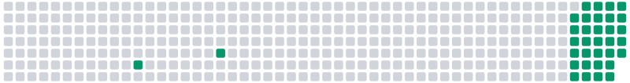

<!--more-->

## Motivation

I am almost done with a monthly challenge to write a blog post every day. Going
forward, I want to see how I am doing with blogging. Something like "GitHub
Contribution Graph" would be a good visual representation of my blogging
activity.

I can only do one thing at a time: either write a blog post or write a Haskell
program. So, I decided to write a blog post that pretends to be a Haskell
program to generate a contribution graph.

## Getting Ready

You can check my previous posts for Literate Haskell programming using Markdown.
I will use the same setup here.

My program need to figure out on which days I wrote a blog post. I can use the
file system to get the list of Markdown file, extract the date from the front
matter, and then generate the contribution graph.

I am not going to do it using Haskell. Instead, I will use shell commands to get
the stream of ISO-formatted dates on which I wrote a blog post:

```sh
find content/posts -type f -iname "*.md" -exec grep -m1 -oE "^date:[ ]*[0-9\-]{10}" {} \; |
  tr -d " " |
  cut -f 2 -d ":"
```

Let me explain the command:

1. `find content/posts -type f -iname "*.md"`: Find all the Markdown files in
   the `content/posts` directory.
2. `-exec grep -m1 -oE "^date:[ ]*[0-9\-]{10}" {} \;`: For each file, extract
   the date from the front matter.
3. `tr -d " "`: Remove all spaces from the `date: YYYY-MM-DD` string.
4. `cut -f 2 -d ":"`: Extract the date part from the `date:YYYY-MM-DD` string.

Then, my program will consume the stream of dates from the `stdin` and generate
the contribution graph.

## Implementation

We will use the following Haskell imports:

```haskell
import Data.Bool (bool)
import Data.Maybe (mapMaybe)
import Data.Set qualified as S
import Data.Time qualified as Time
import Diagrams.Backend.Cairo
import Diagrams.Prelude
import System.Environment (getArgs)
import Text.Read (readMaybe)
```

First, we need to know which dates we wrote a blog post. We will read the dates
from the `stdin` and convert them to a set of dates:

```haskell
type DaysDone = S.Set Time.Day

readDaysDone :: IO DaysDone
readDaysDone = do
  S.fromList . mapMaybe (readMaybe @Time.Day) . lines <$> getContents
```

Here, we define a type `DaysDone` to represent the set of dates. We read the
`stdin` using `getContents`, split the input into lines, and then convert each
line to a `Time.Day`. We use `readMaybe` to convert the string to a `Time.Day`.
If the conversion fails, we get `Nothing`, which we filter out using `mapMaybe`.

Next, we need to be able to generate a timeline, basically a list of dates:

```haskell
type Timeline = [Time.Day]

mkTimeline :: IO Timeline
mkTimeline = do
  let until = Time.fromGregorian 2024 8 30
  --  until <- Time.utctDay <$> Time.getCurrentTime
  let lastYear = Time.addDays (-366) until
  let padding = fromIntegral (fromEnum (Time.dayOfWeek lastYear)) - 1
  let since = Time.addDays (-padding) lastYear
  pure [since .. until]
```

Here, we define a type `Timeline` to represent the list of dates. Our
`mkTimeline` function first marks today, literally. We then go back to the last
year and add a padding to align the timeline with the week starting on Monday.
Finally, we generate the list of dates using the earliest date and the current
date.

Now, we need to mark the timeline with days we wrote a blog post:

```haskell
data DayStatus
  = DayStatusNone
  | DayStatusMiss
  | DayStatusDone
  deriving (Eq, Show)

markTimeline :: DaysDone -> Timeline -> [DayStatus]
markTimeline daysDone timeline =
  fmap (bool DayStatusMiss DayStatusDone . (`S.member` daysDone)) timeline
```

`DayStatus` is an enumeration to represent the status of a day. We define three
statuses:

1. `DayStatusNone`: The day is not in the timeline.
2. `DayStatusMiss`: The day is in the timeline but we missed to write a blog
   post.
3. `DayStatusDone`: The day is in the timeline and we wrote a blog post.

So, `markTimeline` is essentially a mapping function that marks the timeline
with the status of each day.

One thing we will need is to convert the timeline from a list of dates to list
of weeks:

```haskell
asWeekly :: [DayStatus] -> [[DayStatus]]
asWeekly days =
  case take 7 days of
    [] -> []
    xs -> (xs <> replicate (7 - length xs) DayStatusNone) : asWeekly (drop 7 days)
```

It is doing an important job: it is converting the list of days to a list of
weeks. Each week is a list of 7 days. If the week is not complete, we pad it
with `DayStatusNone`.

Now, we need to generate the contribution graph:

```haskell
plotDays :: [[DayStatus]] -> Diagram B
plotDays squares =
  hsep 0.3 (fmap plotWeek squares)


plotWeek :: [DayStatus] -> Diagram B
plotWeek squares =
  vsep 0.3 (fmap plotDay squares)


plotDay :: DayStatus -> Diagram B
plotDay DayStatusNone = square 1 # lw none
plotDay DayStatusMiss = roundedRect 1 1 0.2 # lw none # fc (sRGB24read "#d1d5db")
plotDay DayStatusDone = roundedRect 1 1 0.2 # lw none # fc (sRGB24read "#059669")
```

`plotDays` is a function that takes a list of weeks and generates a diagram. It
is horizontally stacking the weeks with a small gap.

`plotWeek` is a function that takes a week and generates a diagram. It is
vertically stacking the days with a small gap, too.

`plotDay` is a function that takes a day status and generates a diagram. It is
generating a ghost square for `DayStatusNone`, a rounded rectangle with a light
gray color for `DayStatusMiss`, and a rounded rectangle with a green color for
`DayStatusDone`.

Finally, we need to put everything together:

```haskell
main :: IO ()
main = do
  dir <- head <$> getArgs
  daysDone <- readDaysDone
  timeline <- mkTimeline
  let squares = asWeekly (markTimeline daysDone timeline)
  render dir "diagram.svg" (plotDays squares)
  where
    render dpath fname = renderCairo (dpath <> "/" <> fname) (mkSizeSpec2D (Just 800) Nothing) . frame 0.2
```

Let's run the program:

```sh
find ../ -type f -iname "index.md" -exec grep -m1 -oE "^date:[ ]*[0-9\-]{10}" {} \; |
  tr -d " " |
  cut -f 2 -d ":" |
  runhaskell -pgmLmarkdown-unlit index.lhs .
```

Voilà!



## Wrap Up

It seems like I did well with my blogging activity.

I really like diagrams library. I need to find a real project to use it.
Otherwise, I need to keep writing blog posts to generate diagrams.

<!-- REFERENCES -->

[jq]: https://stedolan.github.io/jq/
[qsv]: https://github.com/jqnatividad/qsv
[uplot]: https://github.com/red-data-tools/YouPlot
[xsv]: https://github.com/BurntSushi/xsv
[xColors API]: https://x-colors.yurace.pro/
[EmojiHub API]: https://github.com/cheatsnake/emojihub
